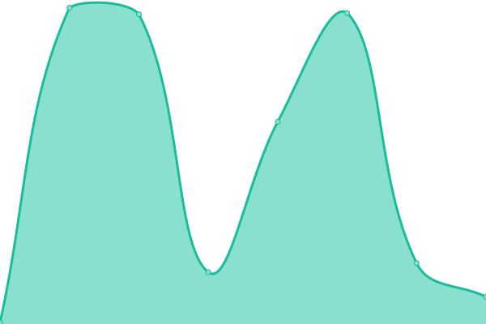
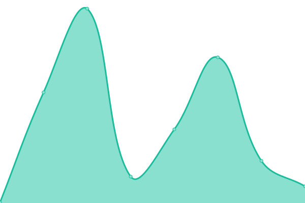

# [📈 Live Status](https://muntasirmahmud.me): <!--live status--> **🟩 All systems operational**

This repository contains the open-source uptime monitor and status page for [Muntasir Mahmud](https://sites.google.com/view/muntasirmahmud/), powered by [Upptime](https://github.com/upptime/upptime).

With [Upptime](https://upptime.js.org), you can get your own unlimited and free uptime monitor and status page, powered entirely by a GitHub repository. We use [Issues](https://github.com/MuntasirSZN/upptime-monitoring/issues) as incident reports, [Actions](https://github.com/MuntasirSZN/upptime-monitoring/actions) as uptime monitors, and [Pages](https://muntasirmahmud.me) for the status page.

<!--start: status pages-->
<!-- This summary is generated by Upptime (https://github.com/upptime/upptime) -->
<!-- Do not edit this manually, your changes will be overwritten -->
<!-- prettier-ignore -->
| URL | Status | History | Response Time | Uptime |
| --- | ------ | ------- | ------------- | ------ |
|  [My Domain](https://muntasirszn.github.io/) | 🟩 Up | [my-domain.yml](https://github.com/MuntasirSZN/upptime-monitoring/commits/HEAD/history/my-domain.yml) | 

 312ms
     
 | 

<a href="https://MuntasirSZN.github.io/upptime-monitoring/history/my-domain">100.00%</a>
    

|  [AI Tic Tac Toe](https://muntasirszn.github.io/AiTicTacToe/) | 🟩 Up | [ai-tic-tac-toe.yml](https://github.com/MuntasirSZN/upptime-monitoring/commits/HEAD/history/ai-tic-tac-toe.yml) | 

 162ms
     
 | 

<a href="https://MuntasirSZN.github.io/upptime-monitoring/history/ai-tic-tac-toe">100.00%</a>
    

|  [Linux Commands Cheat Sheet](https://muntasirszn.github.io/LinuxCommandsCheatSheet) | 🟩 Up | [linux-commands-cheat-sheet.yml](https://github.com/MuntasirSZN/upptime-monitoring/commits/HEAD/history/linux-commands-cheat-sheet.yml) | 

 198ms
     
 | 

<a href="https://MuntasirSZN.github.io/upptime-monitoring/history/linux-commands-cheat-sheet">100.00%</a>
    

<!--end: status pages-->

[**Visit our status website →**](http://muntasirmahmud.me/upptime-monitoring/)

## 📄 License

- Powered by: [Upptime](https://github.com/upptime/upptime)
- Code: [MIT](./LICENSE) © [Anand Chowdhary](https://anandchowdhary.com), supported by [Pabio](https://pabio.com)
- Data in the `./history` directory: [Open Database License](https://opendatacommons.org/licenses/odbl/1-0/)
